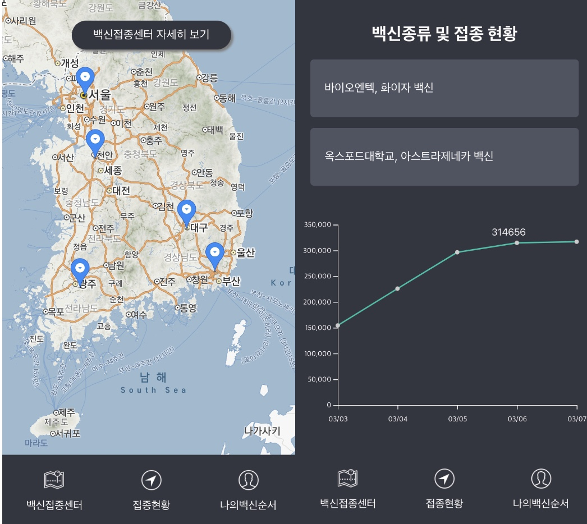

# 코로나19 백신 현황 및 백신접종센터

## 목적
- d3 카카오맵 간단하게 활용해보고 싶어서 만들어봄

## 제작기간
2

## skills
- react
- react-spring
- map: KAKAO MAP 이용
- graph: D3 이용

## 자료제공
- 공공데이터포털 open api
- github covid19 data korea vaccinations cvs file듬

## 화면

